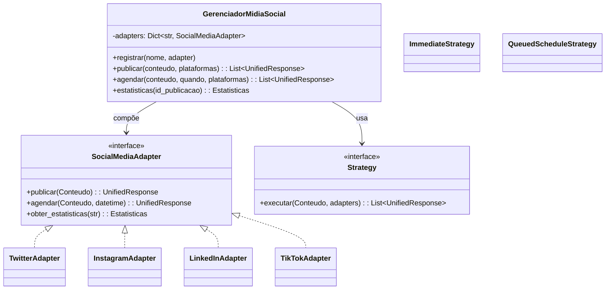

# Sistema Unificado de Mídia Social — Padrão Adapter

Este repositório é um **starter completo** para o exercício prático de integração com **Twitter, Instagram, LinkedIn e TikTok** por meio do **padrão Adapter**, incluindo **Strategy** (agendamento) e **Factory Method** (configuração dinâmica).

> **Obs.** As integrações são **simuladas** (sem chamadas reais). O foco é arquitetura, padrões de projeto e contrato unificado.

## 🎯 Objetivos
- Interface unificada (`GerenciadorMidiaSocial`) para postar, agendar e consultar estatísticas.
- **Adapters** por plataforma traduzindo dados/erros para um **Sistema de Resposta Unificado**.
- **Factory** para instanciar adapters com base em **configuração por ambiente** (`APP_ENV=dev|staging|prod`).
- **Strategy** para agendamento (`ImmediateStrategy`, `QueuedScheduleStrategy`).

## 🚀 Como executar (exemplo)

```bash
# 1) Crie e ative um venv se desejar
python -m venv .venv && source .venv/bin/activate  # (Linux/Mac)
# ou no Windows: .venv\Scripts\activate

# 2) Instale dependências de dev (somente pytest)
pip install -r requirements.txt

# 3) Rode o demo
export APP_ENV=dev  # no Windows: set APP_ENV=dev
python main.py

# 4) Rode os testes
pytest -q
```

## 🧱 Estrutura
```
src/
  social_adapter/
    __init__.py
    manager.py               # GerenciadorMidiaSocial
    models.py                # Conteudo, Publicacao, Estatisticas, UnifiedResponse
    strategy.py              # Strategy p/ agendamento
    factory.py               # Factory Method + configuração dinâmica
    config.py                # Loader de config por ambiente (YAML + env)
    adapters/
      base.py                # Interface SocialMediaAdapter
      twitter.py             # Adapter + API simulada
      instagram.py
      linkedin.py
      tiktok.py
    docs/
      diagrams.md            # Diagramas em Mermaid
config/
  dev.yaml                   # Config de exemplo (tokens falsos)
tests/
  test_unified_flow.py       # Testes de integração simulados
requirements.txt
main.py                      # CLI de demonstração
```

## 🧩 Diagrama (alto nível)



## 📦 Sistema de Resposta Unificado
Todos os adapters retornam `UnifiedResponse`:
- `status: "success" | "scheduled" | "error"`
- `platform`
- `external_id`
- `permalink` (quando houver)
- `message`
- `extra` (dict)

## 🏭 Factory + Config Dinâmica
A `SocialMediaFactory` lê o ambiente (`APP_ENV`) e carrega `config/<env>.yaml`, instanciando somente as plataformas com `enabled: true` e injetando credenciais **falsas**/de teste.

## ✅ Critérios sugeridos de avaliação
- Clareza da separação Adapter / Strategy / Factory.
- Tratamento de erros e **tradução para `UnifiedResponse`**.
- Testes passando.
- README e diagramas claros.

---

> Dica: Acrescente novos adapters sem tocar no `GerenciadorMidiaSocial`.
