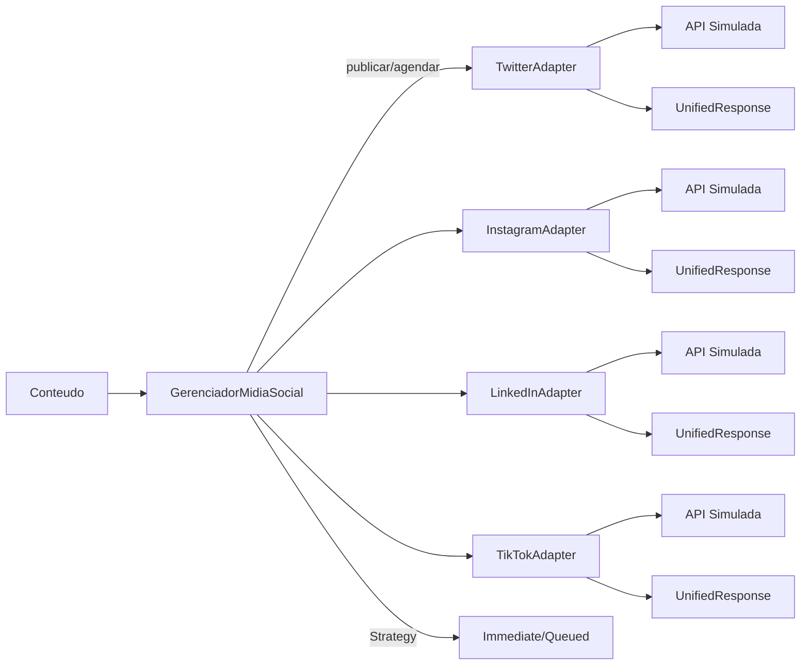

# Diagramas

## Pacotes / Fluxo



## Classe `UnifiedResponse`

```mermaid
classDiagram
class UnifiedResponse {{
  +status: string
  +platform: string
  +message: string
  +external_id: string?
  +permalink: string?
  +extra: dict
}}
```
